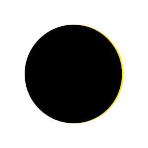
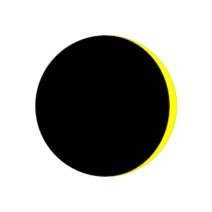
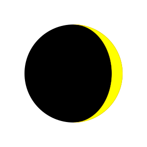
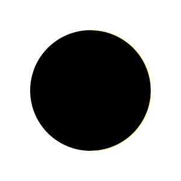
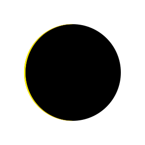
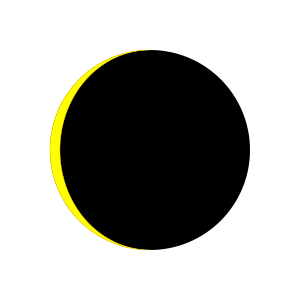
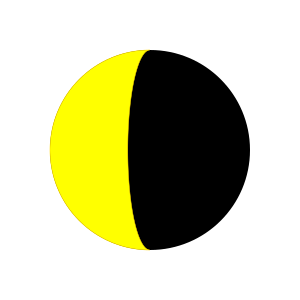
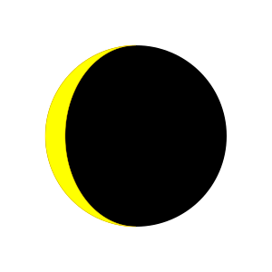

Moon phases over synodic moon 29.530589 split into 28 individual phases.

[Preview of the webpage All28PhasesPage.html](http://htmlpreview.github.io/?https://github.com/chlachula/go2/blob/main/moonPhases/All28PhasesPage.html)

        
        
       
       

---
[Written with Markdown](https://www.markdownguide.org/basic-syntax/)